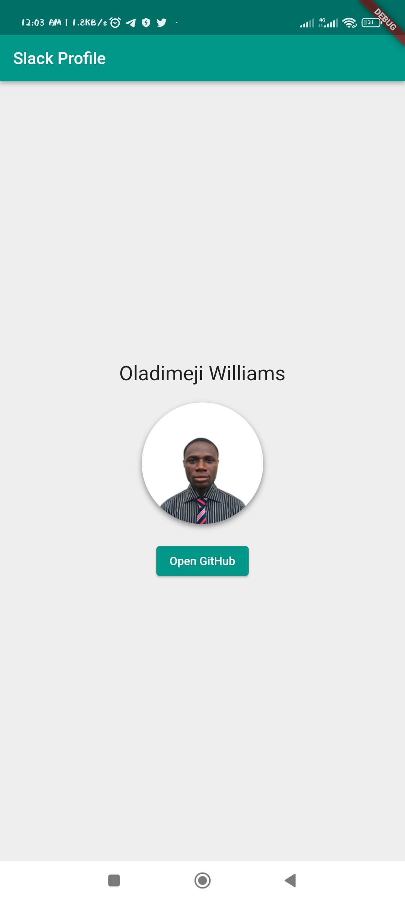
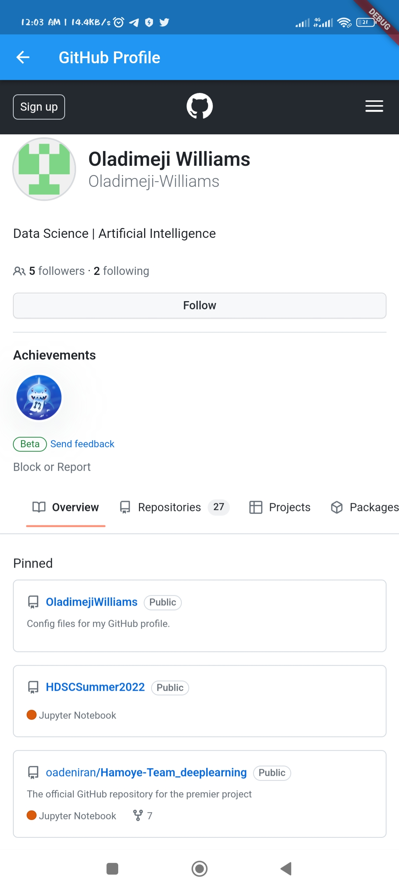

# Slack Profile Viewer
A Flutter mobile application that displays the developer profile of Oladimeji Williams. It features a splash screen, a main screen showcasing the developer's Slack profile, and a button to navigate to the developer's GitHub profile inside a WebView.

## Features
- Splash screen showcasing the developer name.
- Main screen displaying Slack name and profile picture.
- Button to open the developer's GitHub profile inside a WebView.

## Screenshots
- 
- 
- 

## Getting Started
1. Clone the repository:
`git clone https://github.com/your_github_username/slack_github_profile.git`

2. Navigate into the project directory:
`cd slack_github_profile`

3. Install dependencies:
`flutter pub get`

4. Run the application:
`flutter run`

## Requirements
- Flutter SDK
- Android Studio or VS Code with Flutter plugin for editing and running the project.

## Dependencies
- `webview_flutter:` Used to display the GitHub profile inside a WebView.

## Contribution
If you find a bug or would like to suggest a new feature, please [open a new issue](https://github.com/Oladimeji-Williams/slack_github_profile/issues/new). Pull requests are always welcome.

## Link on appetize.io
[slack_github_profile](https://appetize.io/app/jgfiqigpi36wnocle6tvzptacy?device=pixel4&osVersion=12.0&scale=75)

## License
This project is open source and available under the MIT License.
>>>>>>> 911a643824500e779a11ba20e4223b65b3f2c550
